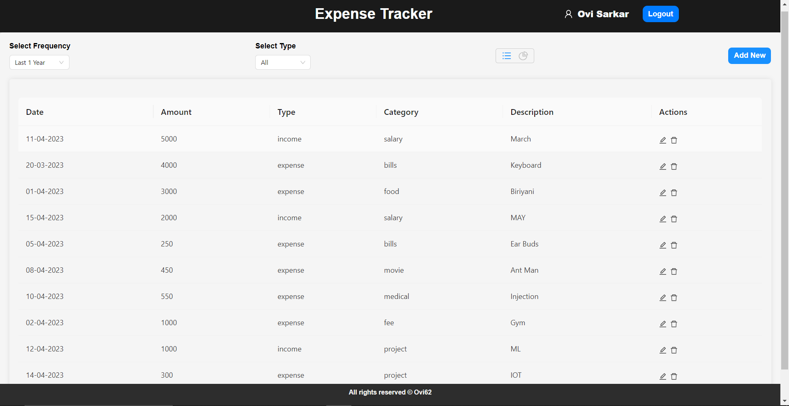
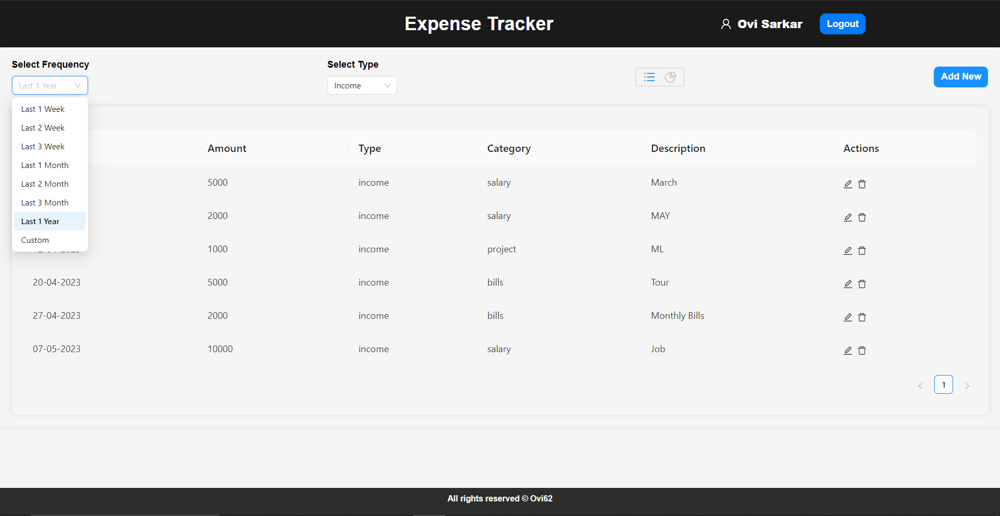
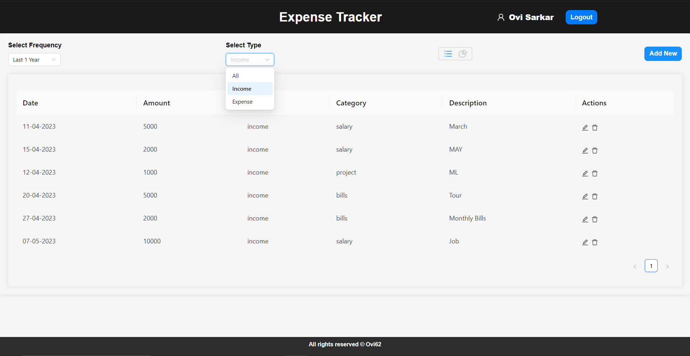

# ExpenseTracker

The ExpenseTracker repository is a web application developed using the MERN stack, designed to help users manage their expenses. The application allows users to create and manage their accounts, add, edit, delete and view their expenses in pie-chart.

## Project View

- **Homepage**

  

- **Frequency Filter**

  

- **Income/Expense Type Filter**

  

- **Add Transaction**

  

- **Income Piechart**

  

- **Expense Piechart**

  

- **Overall Piechart**

  

- **Categorywise Cards**

  

## Installation

To install and run the ExpenseTracker application locally, follow these steps:

- Clone the repository to your local machine using the following command:

       git clone https://github.com/OviSarkar62/ExpenseTracker.git
       
- Navigate to the ExpenseTracker directory:

       cd expensetracker
   
- Install the server side dependencies using the following command:

       npm install express express-session joi moment mongoose morgan nodemon zxcvbn dotenv cors connect-mongo colors bcrypt

- Navigate to the client directory:

       cd client
       
- Install the client side dependencies using the following command:

       npm install react-router-dom react-redux redux react-bootstrap axios antd moment
      
- Create a .env file in the root directory with the following environment variables:

       DB_URL = mongodb+srv://<user>:<pass>@cluster0.l17quyr.mongodb.net/database

       SALT_ROUNDS = 10

- Start the server: 

       node index.js
    
- In a new terminal window, navigate to the client directory:

       cd client
    
- Start the client: 

       npm start
    
- Access the application. Open your web browser and visit http://localhost:3000 to access the application.

## Functionality

The ExpenseTracker application has the following features:

- User Authentication: The application requires users to create an account or log in before they can use the application.

- Add Income: Users can add incomes by clicking on the "Add Income" button and filling out the form.

- Add Expense: Users can add expenses by clicking on the "Add Expense" button and filling out the form.

- Edit Income: Users can edit incomes by clicking on the "Edit" button and updating the form.

- Edit Expense: Users can edit expenses by clicking on the "Edit" button and updating the form.

- Delete Income: Users can delete incomes by clicking on the "Delete" button and updating the form.

- Delete Expense: Users can delete expenses by clicking on the "Delete" button and updating the form.

- View Income/Expense: Users can view their incomes and expenses on the dashboard page, which displays a list of all incomes and expenses as well as in pie-chart.

## Stack

The ExpenseTracker application is built using the following technologies:

- MongoDB: A document-based NoSQL database used to store user data.

- Express: A Node.js framework used to build the RESTful API.

- React: A JavaScript library used to build the user interface.

- Node.js: A JavaScript runtime used to build the backend of the application.

## Live Link
The live project: [ExpenseTracker](https://expense-tracker-ten-zeta.vercel.app/login)
